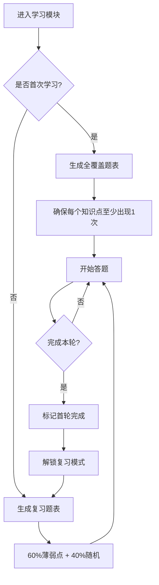

# 六爻学习 App

一个基于 Flutter 开发的六爻基础知识学习应用，采用智能题表管理系统，帮助用户系统性地掌握天干地支、五行、阴阳等传统文化知识。

## 📱 应用简介

本应用旨在帮助用户通过互动式学习方式，掌握六爻占卜的基础知识。采用类似 Anki/百词斩的学习模式，结合首轮全覆盖学习和智能复习系统，确保学习效果。

### 核心特性

- ✅ **智能题表管理**：首轮全覆盖 + 复习模式自动切换
- 📊 **学习进度追踪**：实时记录学习数据和熟练度
- 🎯 **薄弱点强化**：根据答题情况智能调整出题策略
- 📝 **错题本系统**：参数化存储 + 动态重建，高效复习错题
- 💾 **本地数据持久化**：使用 SharedPreferences 保存进度
- 🎨 **现代化 UI 设计**：美观流畅的用户体验

## 🏗️ 项目架构

### 目录结构

```
lib/
├── main.dart                          # 应用入口
├── models/                            # 数据模型层
│   ├── question.dart                  # 题目数据模型
│   ├── module_progress.dart           # 模块进度数据模型
│   └── wrong_question_record.dart     # 错题记录数据模型
├── services/                          # 业务逻辑层
│   ├── question_factory.dart          # 题目工厂（按模块生成题目）
│   ├── questions.dart                 # 具体题目生成器集合
│   ├── rule_functions.dart            # 六爻规则函数（查询天干地支属性）
│   ├── storage_service.dart           # 本地存储服务
│   ├── question_reconstructor.dart    # 错题重建器（从参数重建题目）
│   └── round_manager.dart             # 题表管理器（核心）
├── screens/                           # 页面层
│   ├── learn_screen.dart              # 学习模块选择页
│   ├── tiangan_dizhi_submenu_screen.dart # 天干地支子菜单页
│   ├── study_module_screen.dart       # 学习页面（答题界面）
│   ├── progress_screen.dart           # 进度统计页
│   └── review_screen.dart             # 错题复习页面
├── widgets/                           # 组件层
│   └── flip_card.dart                 # 翻卡片答题组件
└── data/                              # 数据层（静态数据）
    ├── tian_gan.dart                  # 十天干数据
    ├── di_zhi.dart                    # 十二地支数据
    ├── wu_xing.dart                   # 五行生克关系
    ├── zhi_relations.dart             # 地支关系（六合、三合、六冲等）
    └── gua_data.dart                  # 六十四卦数据
```

### 架构设计

```
┌─────────────────────────────────────────────────────────────┐
│                         UI Layer                            │
│  (Screens & Widgets - 用户界面层)                           │
└─────────────────────────────────────────────────────────────┘
                           ↓ ↑
┌─────────────────────────────────────────────────────────────┐
│                      Business Layer                         │
│  (Services - 业务逻辑层)                                     │
│  ┌──────────────────┐  ┌──────────────────┐                │
│  │  RoundManager    │  │ QuestionFactory  │                │
│  │  (题表管理器)     │  │  (题目工厂)       │                │
│  └──────────────────┘  └──────────────────┘                │
│  ┌──────────────────┐  ┌──────────────────┐                │
│  │ StorageService   │  │  RuleFunctions   │                │
│  │  (存储服务)       │  │  (规则函数)       │                │
│  └──────────────────┘  └──────────────────┘                │
└─────────────────────────────────────────────────────────────┘
                           ↓ ↑
┌─────────────────────────────────────────────────────────────┐
│                       Data Layer                            │
│  (Models & Static Data - 数据层)                            │
│  ┌──────────────────┐  ┌──────────────────┐                │
│  │ ModuleProgress   │  │    Question      │                │
│  └──────────────────┘  └──────────────────┘                │
│  ┌──────────────────┐  ┌──────────────────┐                │
│  │  TianGan Data    │  │   DiZhi Data     │                │
│  └──────────────────┘  └──────────────────┘                │
└─────────────────────────────────────────────────────────────┘
```

## 🎯 核心功能设计

### 1. 题表管理系统 (RoundManager)

这是本应用的核心创新点，借鉴了 Anki 和百词斩的学习模式。

#### 设计思路

**混合模式学习策略**：
- **第一层：课本模式** - 首轮学习采用全覆盖题表，确保每个知识点至少练习一次
- **第二层：练习册模式** - 复习模式根据熟练度智能出题，薄弱点优先

#### 工作流程



#### 关键算法

**全覆盖题表生成**（首次学习）：
```dart
// 以天干五行模块为例
List<Question> generateFullCoverage() {
  final gans = ["甲", "乙", "丙", "丁", "戊", "己", "庚", "辛", "壬", "癸"];
  gans.shuffle(); // 打乱顺序，避免死记
  
  return gans.map((gan) => 
    createQuestion(gan, getGanWuXing(gan))
  ).toList();
}
```

**智能复习题表生成**（复习模式）：
```dart
List<Question> generateReviewRound() {
  final weakItems = getItemsWithProficiency < 60; // 熟练度低于60的知识点
  
  // 60%薄弱点 + 40%随机
  final weakQuestions = weakItems.take(12); // 60% of 20
  final randomQuestions = randomItems.take(8); // 40% of 20
  
  return [...weakQuestions, ...randomQuestions]..shuffle();
}
```

### 2. 学习进度管理 (ModuleProgress)

#### 数据结构

```dart
class ModuleProgress {
  String moduleId;                    // 模块ID
  bool firstRoundCompleted;           // 是否完成首轮
  List<String> learnedItems;          // 已学习知识点列表
  Map<String, int> proficiency;       // 熟练度映射 (0-100)
  int currentQuestionIndex;           // 当前题目索引
  int totalCorrectCount;              // 累计答对数
  int totalWrongCount;                // 累计答错数
}
```

#### 熟练度计算

```dart
void updateProficiency(String itemId, bool correct) {
  final currentScore = proficiency[itemId] ?? 50; // 初始50分
  
  if (correct) {
    // 答对：+10分（上限100）
    proficiency[itemId] = (currentScore + 10).clamp(0, 100);
  } else {
    // 答错：-15分（下限0）
    proficiency[itemId] = (currentScore - 15).clamp(0, 100);
  }
}
```

### 3. 本地存储 (StorageService)

使用 `SharedPreferences` 实现轻量级持久化存储。

```dart
// 存储进度
await prefs.setString(
  'module_progress_${moduleId}',
  jsonEncode(progress.toJson())
);

// 加载进度
final jsonString = prefs.getString('module_progress_${moduleId}');
final progress = ModuleProgress.fromJson(jsonDecode(jsonString));
```

## 📚 学习模块

### 1. 天干地支五行
- **内容**：10个天干 + 12个地支的五行属性
- **题量**：首轮22题（全覆盖），复习20题

### 2. 天干地支阴阳
- **内容**：天干地支的阴阳属性
- **题量**：首轮22题，复习20题

### 3. 方位对应
- **内容**：天干地支对应的八方位
- **题量**：首轮22题，复习20题

### 4. 时间对应
- **内容**：地支对应的十二时辰
- **题量**：首轮12题，复习20题

### 5. 十二支指诀
- **内容**：地支在手指关节上的定位记忆法
- **题量**：首轮12题，复习20题

### 6. 六合三合六冲
- **内容**：地支之间的合冲刑害关系
- **题量**：首轮20题（各类型5题），复习20题

### 7. 十二长生
- **内容**：判断爻的旺衰强弱（长生、沐浴、冠带等）
- **题量**：首轮20题，复习20题

### 8. 六十四卦
- **内容**：六十四卦卦名与卦象的对应关系
- **题量**：首轮64题（卦名→卦象 32题 + 卦象→卦名 32题），复习20题

## 🎨 UI/UX 设计

### 设计原则
- **简洁直观**：去除冗余，聚焦学习
- **即时反馈**：答题后立即显示对错
- **进度可视化**：清晰展示学习成果
- **色彩区分**：不同模块使用不同主题色

### 主要界面

#### 1. 学习页（Learn Screen）
- 模块选择卡片
- 渐变背景 + 图标设计
- 点击进入子模块或直接学习

#### 2. 答题页（Study Module Screen）
- 翻卡片交互设计
- 左右滑动切换题目
- 顶部显示学习模式（首轮/复习）
- 进度指示器（X/Y）

#### 3. 进度页（Progress Screen）
- 总体统计卡片（答题数、正确率、完成模块数）
- 模块进度列表（带状态徽章）
- 点击卡片直接跳转学习
- 支持单个/全部进度重置

#### 4. 错题复习页（Review Screen）
- 错题本功能，智能重建错题
- 参数化存储，节省空间
- 支持重复练习，累计错误统计
- 按最近答错时间排序

## 🔧 技术栈

- **框架**：Flutter 3.8.1+
- **语言**：Dart
- **状态管理**：StatefulWidget (内置)
- **本地存储**：shared_preferences ^2.2.2
- **平台支持**：iOS / Android / Web / Windows / macOS / Linux

## 🚀 快速开始

### 环境要求

- Flutter SDK >= 3.8.1
- Dart SDK >= 3.8.1

### 安装步骤

1. **克隆项目**
```bash
git clone <repository-url>
cd liuyao
```

2. **安装依赖**
```bash
flutter pub get
```

3. **运行应用**
```bash
# iOS 模拟器
flutter run

# Android 模拟器/真机
flutter run

# Web
flutter run -d chrome

# 指定设备
flutter devices
flutter run -d <device-id>
```

### 构建发布版本

```bash
# Android APK
flutter build apk --release

# iOS (需要 macOS + Xcode)
flutter build ios --release

# Web
flutter build web --release
```

## 📖 代码规范

### 命名规范
- **类名**：大驼峰（PascalCase）- `ModuleProgress`
- **变量/方法**：小驼峰（camelCase）- `isFirstRoundCompleted`
- **私有成员**：下划线前缀 - `_loadProgress()`
- **常量**：小驼峰 - `const String keyPrefix`

### 注释规范
- **类注释**：描述类的职责和设计目的
- **方法注释**：使用 `///` 格式，说明参数和返回值
- **复杂逻辑**：添加行内注释解释设计意图

示例：
```dart
/// 题表管理器
/// 核心职责：
/// 1. 判断用户是首次学习还是复习模式
/// 2. 首次学习：生成全覆盖题表
/// 3. 复习模式：根据熟练度生成题目
class RoundManager {
  /// 初始化：加载进度并生成题目
  /// 必须在使用 RoundManager 前调用
  Future<void> initialize() async {
    // 实现...
  }
}
```

## 🔍 核心算法详解

### 1. 题目去重与打乱

```dart
// 保证全覆盖的同时打乱顺序
final items = ["甲", "乙", "丙", ...];
items.shuffle(Random()); // 使用随机种子打乱

// 生成题目时确保不重复
final Set<String> usedItems = {};
while (usedItems.length < items.length) {
  final item = items[random.nextInt(items.length)];
  if (!usedItems.contains(item)) {
    usedItems.add(item);
    questions.add(generateQuestion(item));
  }
}
```

### 2. 熟练度衰减机制

```dart
// 每隔一段时间未复习，熟练度自动衰减
void decayProficiency() {
  final now = DateTime.now();
  for (final item in proficiency.keys) {
    final lastReview = lastReviewTime[item];
    final daysPassed = now.difference(lastReview).inDays;
    
    if (daysPassed > 7) {
      // 超过7天未复习，每天衰减2分
      proficiency[item] = (proficiency[item]! - daysPassed * 2).clamp(0, 100);
    }
  }
}
```

### 3. 自适应出题策略

```dart
// 根据用户整体表现动态调整难度
double getWeakRatio() {
  final overallAccuracy = totalCorrect / (totalCorrect + totalWrong);
  
  if (overallAccuracy > 0.9) {
    return 0.3; // 正确率高，减少薄弱点比例
  } else if (overallAccuracy < 0.6) {
    return 0.8; // 正确率低，增加薄弱点比例
  } else {
    return 0.6; // 默认60%
  }
}
```

## 📊 数据流向

```
┌──────────────┐
│   用户操作    │
└──────┬───────┘
       ↓
┌──────────────────────┐
│  StudyModuleScreen   │ ← 答题界面
└──────┬───────────────┘
       ↓
┌──────────────────────┐
│   RoundManager       │ ← 题表管理器
│ - initialize()       │ ← 初始化加载进度
│ - getNextQuestion()  │ ← 获取下一题
│ - submitAnswer()     │ ← 提交答案
│ - completeRound()    │ ← 完成本轮
└──────┬───────────────┘
       ↓
┌──────────────────────┐
│  StorageService      │ ← 存储服务
│ - saveProgress()     │ ← 保存进度
│ - loadProgress()     │ ← 加载进度
└──────┬───────────────┘
       ↓
┌──────────────────────┐
│ SharedPreferences    │ ← 本地存储
└──────────────────────┘
```

## 🎯 未来规划

### 短期计划
- [x] 错题本功能 - 已完成六十四卦模块错题支持
- [ ] 添加答题历史记录查看
- [ ] 实现知识点详情页（查看天干地支属性表）
- [ ] 添加学习提醒功能
- [ ] 支持深色模式

### 中期计划
- [ ] 完善错题本功能（其他模块支持）
- [ ] 实现学习曲线可视化
- [ ] 支持云端同步（可选）
- [ ] 添加成就系统

### 长期计划
- [ ] 扩展高级学习模块（神煞、纳甲装卦等）
- [ ] 实现 AI 智能解答
- [ ] 开发起卦功能
- [ ] 社区分享功能

## 🤝 贡献指南

欢迎提交 Issue 和 Pull Request！

### 提交代码前
1. 确保代码通过 `flutter analyze`
2. 运行 `flutter test` 确保测试通过
3. 遵循现有代码风格
4. 添加必要的注释

## 📄 许可证

本项目采用 MIT 许可证。

## 👨‍💻 作者

- **开发者**：LoopShen
- **联系方式**：[待添加]

## 🙏 致谢

本项目的学习模式设计借鉴了：
- **Anki**：间隔重复学习算法
- **百词斩**：全覆盖 + 复习模式
- **Duolingo**：游戏化学习体验

---

📱 **开始学习六爻，从这里启程！**
